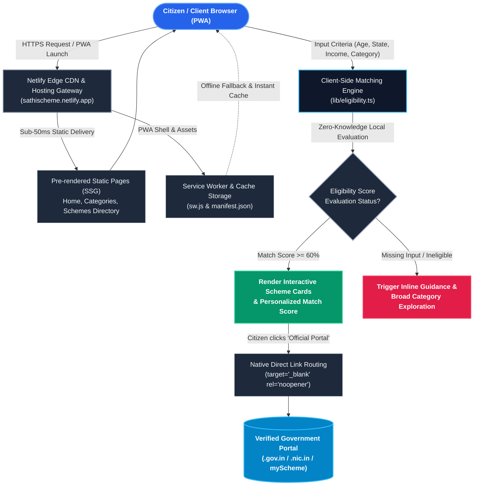
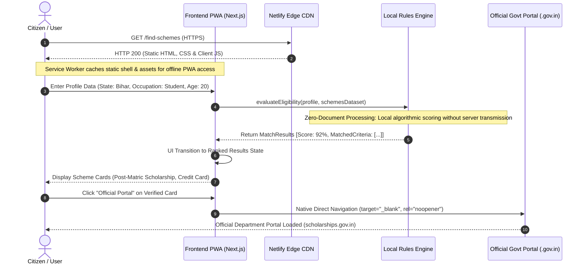

# SchemeSaathi — Indian Government Benefits Discovery Platform

[](https://sathischeme.netlify.app/)
[](https://nextjs.org/)
[](https://react.dev/)
[](https://tailwindcss.com/)
[](https://sathischeme.netlify.app/)

> ### 🌐 Live Application
> **Official Live Website:** **[https://sathischeme.netlify.app/](https://sathischeme.netlify.app/)**  
> *Fully responsive civic platform with PWA mobile installation & direct verified government portal routing.*

An independent, third-party civic-technology platform designed to help Indian citizens discover Central and State Government schemes they may be eligible for — with **zero document collection**, transparent criteria scoring, and unblockable direct redirection to official `.gov.in` and `.nic.in` portals.

---

## 🏗️ Architecture

The SchemeSaathi architecture is engineered for dual-mode execution: instantaneous sub-50ms static delivery via Netlify Global Edge CDN, client-side zero-knowledge eligibility matching engine, and progressive web application (PWA) offline synchronization with verified routing to official Central & State Government portals.

### High-Level Flow



### Component & Execution Flow



---

## 🌟 Key Architecture Highlights

- **🔒 Zero-Knowledge Civic Privacy:** No collection or remote storage of Aadhaar numbers, PAN, bank credentials, phone numbers, or uploaded documents. All eligibility scoring runs strictly client-side.
- **⚡ 100% Static HTML Pre-Rendering:** All scheme profiles, directory filters, and taxonomy categories are pre-generated at compile time (`output: "export"`) with `generateStaticParams()`.
- **📱 Progressive Web App (PWA):** Installs seamlessly on Android, iOS, and Desktop devices with service worker caching (`sw.js`), Web App Manifest (`manifest.json`), and custom adaptive maskable icons.
- **🔗 Unblockable Official Redirection:** Built with native target navigation to prevent mobile popup blockers from preventing citizen access to `.gov.in` and `.nic.in` portals.
- **🌐 15 Verified Live Government Schemes:** Fully tested and updated endpoint links for PM-KISAN, Ayushman Bharat PM-JAY, PMAY-G, Mudra Yojana, PMKVY, Sukanya Samriddhi, and State initiatives.

---

## 🛠️ Technology Stack

| Layer | Technology |
| :--- | :--- |
| **Framework** | Next.js 16.3.8 (App Router, Static Export) |
| **Library** | React 19.2.8 |
| **Styling** | Tailwind CSS v4, Vanilla CSS Custom Variables |
| **Icons** | Lucide React |
| **PWA & Offline** | Service Worker Cache API, Web App Manifest |
| **Hosting & CDN** | Netlify Global Edge Network |
| **Language** | TypeScript 5 |

---

## 📂 Repository Structure

```
.
├── netlify.toml                        # Root Netlify configuration (base = "schemesaathi")
├── README.md                           # Main architecture & repository documentation
└── schemesaathi/                       # Next.js Application Root
    ├── app/                            # App Router Routes & Static Pages
    │   ├── categories/                 # Scheme Taxonomy & Category Pages
    │   ├── central-schemes/            # Central Government Schemes
    │   ├── compare/                    # Side-by-Side Scheme Comparison
    │   ├── find-schemes/               # 4-Step Eligibility Wizard
    │   ├── results/                    # Search & Dynamic Filter Directory
    │   ├── scheme/[id]/                # Static SSG Individual Scheme Details
    │   ├── state-schemes/              # 36 States & UTs Directory
    │   ├── layout.tsx                  # Root layout with PWA Meta & Providers
    │   └── page.tsx                    # Landing Page
    ├── components/                     # Reusable Civic UI Components
    │   ├── EligibilityWizard.tsx       # Multi-Step Criteria Form
    │   ├── ExternalLinkModal.tsx       # Official Portal Warning Dialog
    │   ├── PwaRegister.tsx             # Service Worker Registration & Install Banner
    │   └── SchemeCard.tsx              # Interactive Scheme Card
    ├── data/                           # Verified Schemes & Taxonomy Datasets
    ├── lib/                            # Matching Algorithm & Bilingual Context
    ├── public/                         # PWA Icons, Manifest, SW & Netlify Redirects
    │   ├── manifest.json               # Web App Manifest
    │   ├── sw.js                       # Service Worker for PWA
    │   └── _redirects                  # SPA & 404 Routing Rules
    ├── netlify.toml                    # Subdirectory Netlify Build Configuration
    └── package.json                    # Project dependencies & build scripts
```

---

## 🚀 Quick Start

### 1. Clone & Install
```bash
git clone https://github.com/Shivaniroy09/SchemeSathi-Ai-Project.git
cd SchemeSathi-Ai-Project/schemesaathi
npm install
```

### 2. Development Server
```bash
npm run dev
```
Open [http://localhost:3000](http://localhost:3000) to view the application.

### 3. Build & Static Export
```bash
npm run build
```
Generates pure static assets into `schemesaathi/out/`.

### 4. Create Netlify Deployment Zip
```bash
npm run build:zip
```
Compiles the static export and creates `schemesaathi-netlify.zip` ready for drag-and-drop on [Netlify Drop](https://app.netlify.com/drop).

---

## 👩‍💻 Developed & Designed by

**Shivani**  
*Creator & Developer of SchemeSaathi*

- **LinkedIn:** [https://www.linkedin.com/in/shivani2302/](https://www.linkedin.com/in/shivani2302/)
- **GitHub:** [https://github.com/Shivaniroy09](https://github.com/Shivaniroy09)
- **Instagram:** [https://www.instagram.com/shivaniii.jpeg/](https://www.instagram.com/shivaniii.jpeg/)
- **Email:** [shivaniroy2309@gmail.com](mailto:shivaniroy2309@gmail.com)

---

## 📜 Legal Disclaimer

SchemeSaathi is an **independent third-party civic platform** and is **NOT** affiliated with, authorized, or operated by the Government of India or any State Government. SchemeSaathi does not process government applications, disburse benefits, or determine official beneficiary approvals. All applications are submitted directly on official government websites.

---

© 2026 SchemeSaathi. Designed & Developed by Shivani. All rights reserved.
